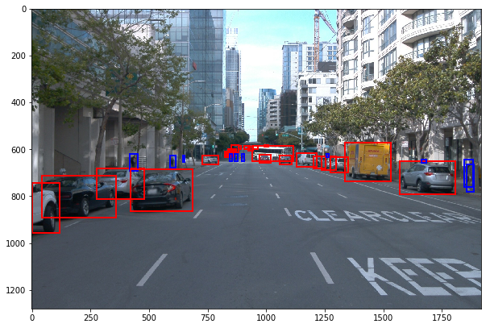

## Object Detection in Urban Environment

### Project overview
Perception is a crucial stack in the Automated Driving pipeline, the first pillar indeed.  
In order to safely drive, the environment must be perceived with high accuracy and traffic objects are certainly a big part of it.  
Urban scenarios are particularly challenging in this sense, as traffic objects are very present, including vulnerable ones, like pedestrians or cyclists.  
The front camera sensor is one of the main sources of information to build the traffic object detection stack: **deep learning models** are the state of art to accomplish this task.  
For this project, I trained a **Single Shot Detector (SSD)** ([paper](https://arxiv.org/pdf/1512.02325.pdf), [baseline pretrained model](http://download.tensorflow.org/models/object_detection/tf2/20200711/ssd_resnet50_v1_fpn_640x640_coco17_tpu-8.tar.gz)) using data from the [Waymo Open dataset](https://waymo.com/open/).

### Dataset
#### Dataset analysis
For this project 100 segments from the **Waymo Open dataset** have been used to train the **Object Detection** model. Each segment comprises about 20s of video stream collected at 10Hz frame rate (about 20k frames).  
The dataset includes 2D tags for three object classes:
 - vehicles
 - pedestrians
 - cyclists

While vehicles and pedestrians are widely present, cyclists are way more rare.  
Daylight, night and foggy images from U.S. urban scenarios are included.  

For a visual exploration of the above mentioned, as well as a basic quantitative analysis see [here](Exploratory%20Data%20Analysis.ipynb) and [here](Exploratory%20Data%20Analysis%20cross_valid.ipynb)

#### Cross validation
The chosen dataset cardinality is quite limited, but still fit for fine tuning a model. In order to split it into training, validation and test trunches, I had to assure a minimum quantitative significance of the validation and test sets. I went for a 70-15-15 split:
- it guarantees a minimum of about 3k frames for testing and validation
- it guarantees a minimum occurrence of more rare scenarios like night, fog and presence of cyclists in all the sets  

As there was no meta tagging, some trial and error split based on visual analysis has been necessary. This still refers to the above mentioned [notebook](Exploratory%20Data%20Analysis%20cross_valid.ipynb).

### Training 
#### Reference experiment
The first training was performed using the reference config file generated by the `edit_config` utility.
Tensorboard metrics show a clearly improving trend throughout the optimization process.

An inference video `outputs/reference_animation.mp4` was then generated using the `exporter_main_v2` utility.

#### Improve on the reference
In order to improve the generalization performance of the object detector I experimented with artificial data augmentation.
After a few test I decided to introduce 2 variations (see `pipeline_exp0.config`):

- *random_brightness_adjust*
- *random_contrast_adjust*

I made my choice supported by tests executed in the following [notebook](Explore%20augmentations.ipynb)

I then trained the model again.

A new inference video `outputs/experiment0_animation.mp4` was then generated using the `exporter_main_v2` utility.

Results are worse then expected: using augmentation affects optimization parameters, so a consequent parameters adjustment shoul be done. In addition, it is not trivial to choose augmentations that are meaninful to a given problem.

 

